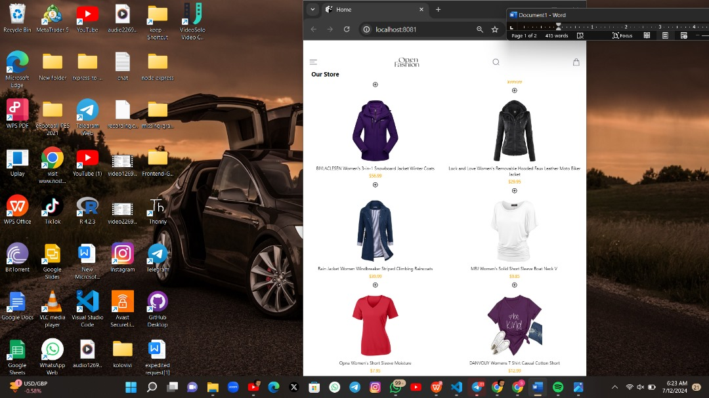
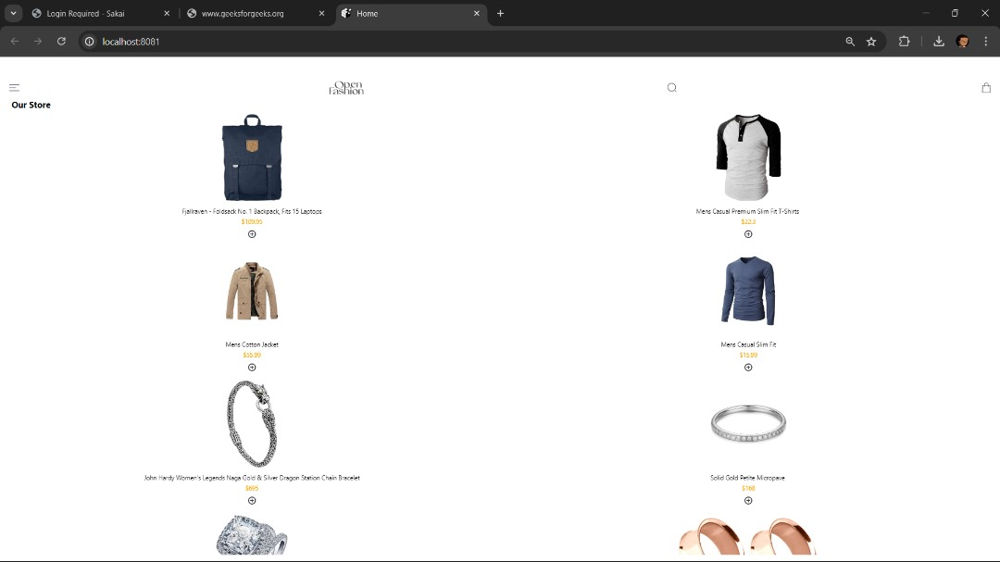
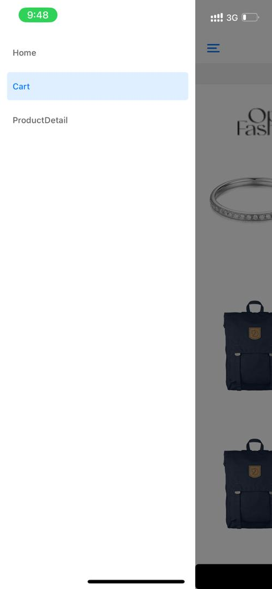
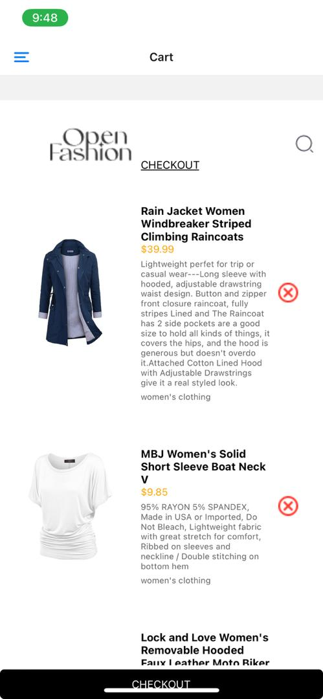
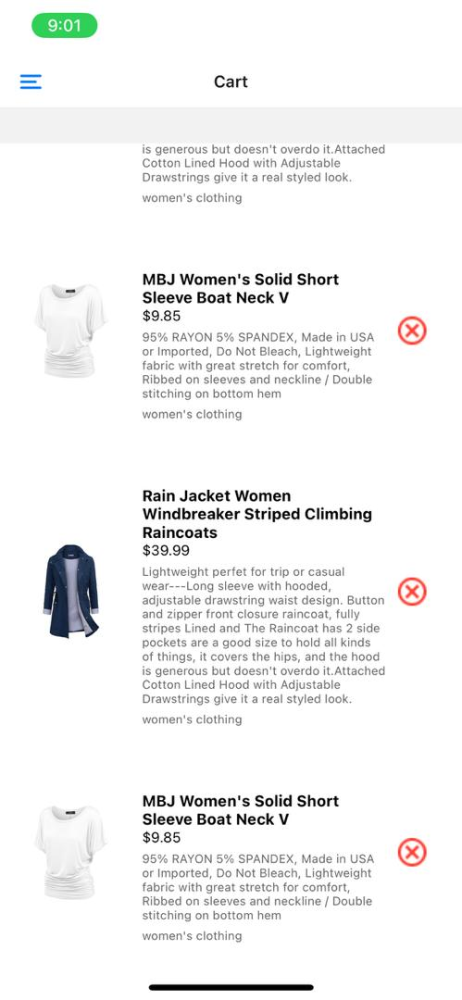
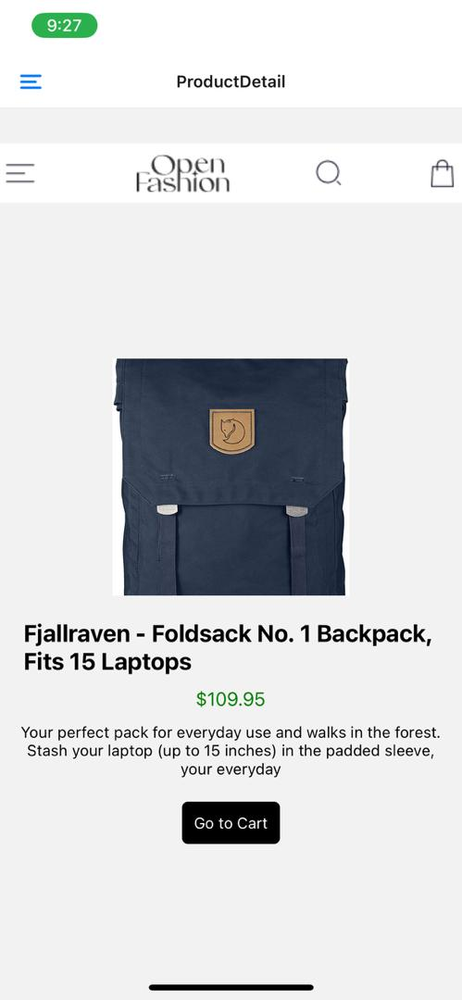

# rn-assignment7-11078728.

# React Native E-commerce App
This project is a React Native E-commerce application developed as part of the DCIT202 Mobile Application Development course. The app allows users to browse products, view product details, and manage their shopping cart.

# Features
1. Home Screen: Displays a list of products fetched from a remote API.

2. Product Details: Allows users to view detailed information about a selected product.

3. Shopping Cart: Users can add products to their cart and view their cart items.

4. Persistent Storage: Cart items are stored using AsyncStorage to maintain state across sessions.

# Screens

1. Home Screen

Displays a grid of products.
Each product shows an image, title, and price.
Users can tap on a product to view its details.
Users can add a product to their cart by tapping the cart icon on the product image.

2. Product Details Screen

Shows detailed information about a selected product, including image, title, price, description, and category.
Users can add the product to their cart from this screen.

3. Cart Screen

Displays a list of products added to the cart.
Each cart item shows an image, title, price, description, and category.
Users can remove items from their cart.
A checkout button is available to proceed with the purchase (navigation to Home for this assignment).

# Installation
1. Clone the repository :
git clone https://github.com/pkay28748/rn-assignment7-11078728..git  and in the terminal
cd rn-assignment7-11078728. and after that type: cd myky-kay(this will take you to the projects directory).

2. Install dependencies :
    npm install and also install the dependencies for the various navigators used for the project.

3. Start the development server:
npm start
npx expo start --tunnel (for those using tunnel for the connection).

4. Run the app:
    npm run andriod /npm run ios/ npm run web .

# Dependencies
1. React Native: The core framework for building the app.
2. Expo: A framework and platform for universal React applications.
3. Axios: For making HTTP requests to fetch product data.
4. AsyncStorage: For storing and retrieving cart items.
5. React Navigation: For handling navigation between screens.
6. React Native Vector Icons: For displaying icons in the app.

# Project Structure
1. components/
Contains reusable UI components like headers and buttons.

2. screens/
Contains the main screens of the app: HomeScreen, ProductDetailScreen, and CartScreen.

3. assets/
Contains image assets used in the app.

# Development Notes
1. Fetching Data: Product data is fetched from https://fakestoreapi.com/products.
2. State Management: The app uses React hooks (useState, useEffect) for managing state.
3. Navigation: React Navigation is used for navigating between the Home, Product Details, and Cart screens.
4. Persistent Storage: Cart items are stored in AsyncStorage to maintain state across app restarts.

# Authors
Prince Nana Kwesi Arthur
Course: DCIT202 Mobile Application Development
Institution: University of Ghana
Instructor: Paul Ammah Tackie

# License
This project is licensed under the MIT License - see the LICENSE file for details.

# Screenshots of the app

